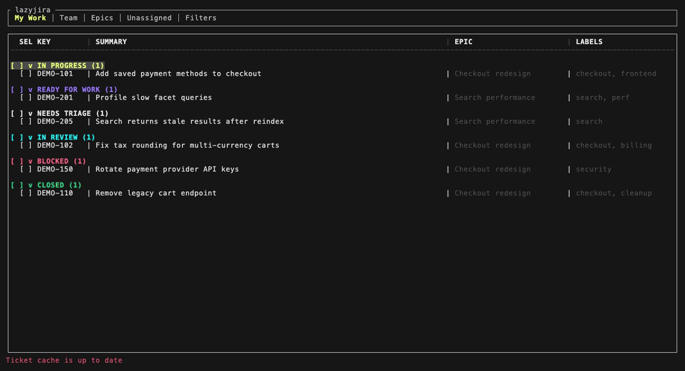

# lazyjira

A fast, keyboard-driven terminal UI for Jira, built for daily triage and for keeping an eye on your team's work.

lazyjira runs on top of the [`jira` CLI](https://github.com/ankitpokhrel/jira-cli). It uses your existing CLI login, opens instantly from a local cache, and refreshes in the background. It was built for one team's workflow on `jira.mongodb.org`, so a few parts still assume that instance (see [Limitations](#limitations)).



## Features

- Five tabs: **My Work**, **Team**, **Epics**, **Unassigned**, **Filters**
- Tickets grouped by status, with one-key status focus and a Done toggle
- Epic progress bars, with an optional list of the epics you care about
- Ticket detail with description, labels, assignee, epic, and activity history
- Create, comment on, assign, edit, and move tickets without leaving the terminal
- Multi-select with bulk move and bulk assign
- Bulk ticket creation from a CSV, with a validated preview before anything is sent
- Saved JQL filters
- Local cache for fast startup and instant detail views

## Requirements

- The [`jira` CLI](https://github.com/ankitpokhrel/jira-cli) on your `PATH` and logged in (`jira init`). Running `jira me` should print your email.
- macOS (Apple Silicon or Intel) or Linux x86_64. Windows is not supported.
- A stable Rust toolchain, only if you build from source.

## Install

Download the prebuilt binary from the [latest GitHub Release](https://github.com/cdowellmdb/lazyjira/releases/latest). Set `TARGET` for your platform:

| Platform | `TARGET` |
|----------|----------|
| macOS, Apple Silicon | `aarch64-apple-darwin` |
| macOS, Intel | `x86_64-apple-darwin` |
| Linux x86_64 | `x86_64-unknown-linux-gnu` |

```bash
TARGET=aarch64-apple-darwin
curl -fL -o lazyjira.tar.gz "https://github.com/cdowellmdb/lazyjira/releases/latest/download/lazyjira-$TARGET.tar.gz"
tar -xzf lazyjira.tar.gz
mkdir -p ~/.cargo/bin
mv lazyjira ~/.cargo/bin/lazyjira
```

Make sure `~/.cargo/bin` is on your `PATH`, or move the binary to another directory that is. Run `lazyjira --help` to check the install. To update, run the same commands again.

To build from source instead:

```bash
# From a local checkout
cargo install --path . --force

# From a release tag
cargo install --git https://github.com/cdowellmdb/lazyjira --tag v0.1.1
```

## Quick start

```bash
lazyjira
```

The first run asks for two things:

1. **Jira project key**, for example `AMP`.
2. **Team name**, which must match your team's value in the Jira `Assigned Teams` field. The Unassigned tab uses it to find your team's unassigned tickets.

lazyjira then saves `~/.config/lazyjira/config.toml`, adds you to the team roster using the email from `jira me`, and loads your tickets. Press `?` at any time to see the keybindings.

To see teammates in the Team tab, add them to the `[team]` section of the config file and restart lazyjira.

## Configuration

Config lives at `~/.config/lazyjira/config.toml`. lazyjira reads it once at startup.

```toml
[jira]
project = "AMP"
team_name = "Code Generation"
done_window_days = 14
epics_i_care_about = ["AMP-100", "AMP-200"]

[team]
"Alice Smith" = "alice.smith@example.com"
"Bob Jones" = "bob.jones@example.com"

[statuses]
active = ["Needs Triage", "Ready for Work", "To Do", "In Progress", "In Review", "Blocked"]
done = ["Done", "Closed"]

[[filters]]
name = "My bugs"
jql = "type = Bug AND assignee = currentUser()"

[[filters]]
name = "Recent P1s"
jql = "priority = P1 AND created >= -7d"
```

| Key | Default | What it does |
|-----|---------|--------------|
| `jira.project` | required | Jira project key to query. |
| `jira.team_name` | required | Your team's `Assigned Teams` value. Used by the Unassigned tab. |
| `jira.done_window_days` | `14` | How many days of recently finished tickets to load. |
| `jira.epics_i_care_about` | empty (all epics) | Limits the Epics tab to these epics, in this order. Must be in the `[jira]` section. |
| `team` | you | Display name mapped to Jira email for everyone shown in the Team tab. |
| `statuses.active`, `statuses.done` | shown above | Status names that count as active or done when loading tickets. |
| `resolutions` | built-in list | Resolutions offered when you move a ticket to Closed. This is a top-level key, so put it above `[jira]`. |
| `filters` | empty | Saved JQL filters for the Filters tab. |

When you create, edit, or delete a saved filter in the app, lazyjira rewrites this file, and any comments you added are lost.

## Keybindings

### Global

| Key | Action |
|-----|--------|
| `Tab` | Next tab |
| `j/k`, `Up/Down` | Navigate |
| `Enter` | Open ticket detail (or epic detail on an Epics header) |
| `/` | Search tickets, labels, and team members (`Esc` to exit) |
| `Space` | Toggle ticket/group selection |
| `A` | Select all visible tickets |
| `u` | Clear selected tickets |
| `B` | Open bulk action menu (move/assign) |
| `U` | Open bulk CSV upload |
| `c` | Create ticket |
| `z/Z` | Fold current group / fold all groups |
| `d` | Toggle Done visibility |
| `p/w/n/v` | Focus In Progress / Ready for Work / Needs Triage / In Review |
| `r` | Refresh |
| `?` | Keybindings help |
| `q` | Quit |

### Detail view

| Key | Action |
|-----|--------|
| `Esc` | Close |
| `Up/Down` | Scroll |
| `o` | Open in browser |
| `m` | Move status |
| `C` | Comment |
| `a` | Assign/reassign |
| `e` | Edit summary + labels |
| `h` | Activity history |

In the move picker, press `p/w/n/t/v/b/c` (In Progress, Ready for Work, Needs Triage, To Do, In Review, Blocked, Closed) to pick a status, then `Enter` or `y` to confirm. Press the uppercase letter to move right away. Moving to Closed asks for a resolution.

### Filters tab

| Key | Action |
|-----|--------|
| `j/k` | Navigate within focused pane |
| `Tab` | Switch to results / next tab |
| `Shift+Tab` | Back to sidebar |
| `Enter` | Run filter (sidebar) / open ticket (results) |
| `n` | New filter |
| `e` | Edit filter |
| `x` | Delete filter |
| `z/Z` | Fold current status group / fold all status groups |
| `Space`, `A`, `u`, `B` | Select and bulk actions (results pane) |
| `U` | Open bulk CSV upload |

## Bulk CSV upload

Press `U` from any main view, enter the path to a CSV file, and review the preview. You can only submit once the preview shows zero invalid rows. Start from the template in [`docs/examples/bulk_create_template.csv`](docs/examples/bulk_create_template.csv).

```csv
summary,type,assignee_email,epic_key,labels,description
"Fix flaky login test",Bug,qa@example.com,AMP-5678,"test|stability","Intermittent failure in CI"
```

- `summary` is the only required column.
- Optional columns: `type`, `assignee_email`, `epic_key`, `labels`, `description`.
- `type` defaults to `Task` and must be `Task`, `Bug`, or `Story`.
- Separate `labels` with `|` in one cell, for example `frontend|urgent`.
- `epic_key` must match an epic lazyjira has already cached.
- Up to 500 rows per upload.

The preview also warns about summaries that match an existing ticket or repeat within the CSV. Warnings don't block submission, but validation errors do.

## Cache

- On startup, lazyjira shows the last saved snapshot, then refreshes active tickets, then recently finished ones.
- Epic relationships and ticket details are cached and refreshed in the background.
- Cache files are per project: a snapshot in `~/.cache/lazyjira/`, plus epic and ticket-detail caches named `lazyjira_*` in the system temp directory (`$TMPDIR`, or `/tmp`).

## Limitations

- Browser links (`o`) always point to `https://jira.mongodb.org/browse/…`, and they open with the macOS `open` command, so they may not work on Linux.
- The Unassigned tab queries the `Assigned Teams` custom field. It doesn't work on Jira instances that don't have that field.
- The move picker offers a fixed set of statuses: Needs Triage, Ready for Work, To Do, In Progress, In Review, Blocked, and Closed. `[statuses]` changes which tickets are loaded, not where you can move them.
- New tickets, from the create form or a CSV, can only be `Task`, `Bug`, or `Story`.

## Development

```bash
cargo test
cargo run --release
```

`lazyjira --dev` rebuilds from the source checkout the binary was built from, then runs it. `--dev-release` does the same with an optimized build. Both flags only work for binaries built from a local checkout, not for release downloads.

To re-record the demo GIF, install [VHS](https://github.com/charmbracelet/vhs) and run `docs/demo/record.sh`. It uses a fake `jira` CLI and a throwaway `HOME`, so no real Jira data ends up in the recording.

Releases are published by pushing a `v*` tag. See [`docs/RELEASING.md`](docs/RELEASING.md).
