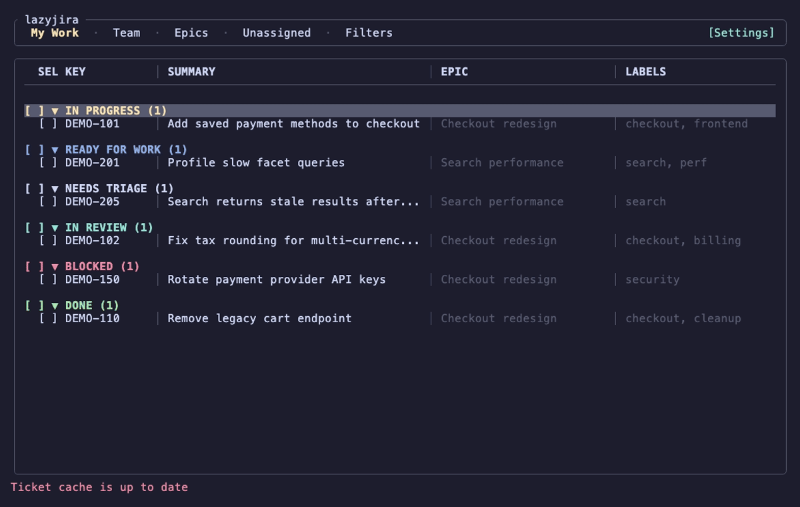
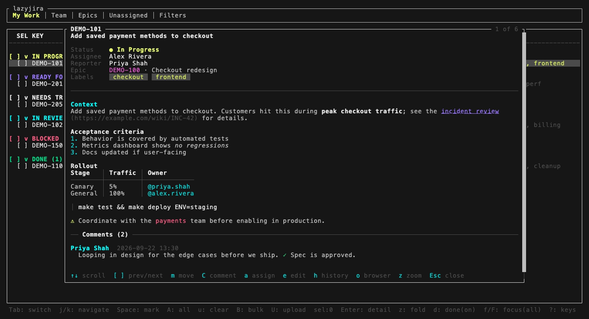

# lazyjira

A fast terminal UI for Jira, with keyboard and mouse controls for daily triage and keeping an eye on your team's work.

lazyjira runs on top of the [`jira` CLI](https://github.com/ankitpokhrel/jira-cli). It uses your existing CLI login and Jira server, opens instantly from a local cache, and refreshes in the background. See [Limitations](#limitations) for workflow and platform requirements.



## Features

- Five tabs: **My Work**, **Team**, **Epics**, **Unassigned**, **Filters**
- Mouse controls for tabs, rows, scrolling, forms, pickers, and action menus
- Tickets grouped by status, with one-key status focus and a Done toggle
- Epic progress bars, with an optional list of the epics you care about
- Ticket detail with formatted description, comments, labels, assignee, epic, and activity history
- Create, comment on, assign, edit, and move tickets without leaving the terminal
- Cursor editing, multiline paste, and external editors for ticket content
- Searchable assignee and epic pickers
- In-app preferences for teammates, pinned epics, Done visibility, and starting tab
- Multi-select with bulk move and bulk assign
- Bulk ticket creation from a CSV, with a validated preview before anything is sent
- Saved JQL filters
- Local cache for fast startup and instant detail views, with your place preserved across refreshes and tab changes

## Requirements

- The [`jira` CLI](https://github.com/ankitpokhrel/jira-cli) on your `PATH` and logged in (`jira init`). Running `jira me` should print your email.
- `JIRA_API_TOKEN` set in your environment, as jira-cli normally uses it. Moves go through Jira's REST API with jira-cli's `server` and `auth_type` settings and this token.
- macOS (Apple Silicon or Intel) or Linux x86_64. Windows is not supported.
- A stable Rust toolchain, only if you build from source.

## Install

Download the prebuilt binary from the [latest GitHub Release](https://github.com/cdowellmdb/lazyjira/releases/latest). Set `TARGET` for your platform:

| Platform | `TARGET` |
|----------|----------|
| macOS, Apple Silicon | `aarch64-apple-darwin` |
| macOS, Intel | `x86_64-apple-darwin` |
| Linux x86_64 | `x86_64-unknown-linux-gnu` |

```bash
TARGET=aarch64-apple-darwin
curl -fL -o lazyjira.tar.gz "https://github.com/cdowellmdb/lazyjira/releases/latest/download/lazyjira-$TARGET.tar.gz"
tar -xzf lazyjira.tar.gz
mkdir -p ~/.cargo/bin
mv lazyjira ~/.cargo/bin/lazyjira
```

Make sure `~/.cargo/bin` is on your `PATH`, or move the binary to another directory that is. Run `lazyjira --help` to check the install. To update, run the same commands again.

To build from source instead:

```bash
# From a local checkout
cargo install --path . --force

# From a release tag
cargo install --git https://github.com/cdowellmdb/lazyjira --tag v0.6.0
```

## Quick start

```bash
lazyjira
```

The first run asks for two things:

1. **Jira project key**, for example `AMP`.
2. **Team name**, which must match your team's value in the Jira `Assigned Teams` field. The Unassigned tab uses it to find your team's unassigned tickets.

lazyjira then saves `~/.config/lazyjira/config.toml`, adds you to the team roster using the email from `jira me`, and loads your tickets. Press `?` at any time to see the keybindings.

Press `S` or click **Settings** to manage teammates, pinned epics, Done visibility, and your starting tab. Team and epic changes refresh without restarting.

## Configuration

Config lives at `~/.config/lazyjira/config.toml`. lazyjira reads it once at startup.

```toml
[jira]
project = "AMP"
team_name = "Code Generation"
done_window_days = 14
epics_i_care_about = ["AMP-100", "AMP-200"]

[team]
"Alice Smith" = "alice.smith@example.com"
"Bob Jones" = "bob.jones@example.com"

[statuses]
active = ["In Progress", "Ready for Work", "Needs Triage", "To Do", "In Review", "Blocked"]
done = ["Done", "Closed"]

[[filters]]
name = "My bugs"
jql = "type = Bug AND assignee = currentUser()"

[[filters]]
name = "Recent P1s"
jql = "priority = P1 AND created >= -7d"

[preferences]
show_done = true
start_tab = "My Work"
```

| Key | Default | What it does |
|-----|---------|--------------|
| `jira.project` | required | Jira project key to query. |
| `jira.team_name` | required | Your team's `Assigned Teams` value. Used by the Unassigned tab. |
| `jira.done_window_days` | `14` | How many days of recently finished tickets to load. |
| `jira.epics_i_care_about` | empty (all epics) | Limits the Epics tab to these epics, in this order. Must be in the `[jira]` section. |
| `team` | you | Display name mapped to Jira email for everyone shown in the Team tab. |
| `statuses.active`, `statuses.done` | shown above | Which statuses are loaded, and which count as done: `d` hides done tickets, epic progress counts them, and Team lists them after active work. So adding e.g. `"Cancelled"` or `"Won't Do"` to `done` treats them as finished. The order is also the order status groups are shown in My Work, Filters and Epics: active statuses first, then statuses not listed, then done. Tickets show Jira's own status name (Resolved stays Resolved). A status not listed follows a listed one it's a synonym of (Resolved follows Done, Open follows To Do); otherwise Done/Closed/Resolved-like names count as done and the rest as active. |
| `filters` | empty | Saved JQL filters for the Filters tab. |
| `preferences.show_done` | `true` | Whether Done tickets are visible. Updated when you press `d` or save preferences. |
| `preferences.start_tab` | `"My Work"` | Starting tab: `My Work`, `Team`, `Epics`, `Unassigned`, or `Filters`. |

Saved filter and preference changes rewrite this file, and any comments you added are lost.

## Keybindings

### Global

| Key | Action |
|-----|--------|
| `Tab` | Next tab |
| `Shift+Tab` | Previous tab (in Filters: back to sidebar) |
| `j/k`, `Up/Down` | Navigate |
| `Enter` | Open ticket detail (or epic detail on an Epics header) |
| `/` | Search tickets, labels, and team members (`Esc` to exit) |
| `Space` | Toggle ticket/group selection |
| `A` | Select all visible tickets |
| `u` | Clear selected tickets |
| `B` | Open bulk action menu (move/assign) |
| `U` | Open bulk CSV upload |
| `c` | Create ticket |
| `S` | Preferences: teammates, pinned epics, Done visibility, starting tab |
| `z/Z` | Fold current group / fold all groups |
| `d` | Toggle visibility of done statuses (`statuses.done`) |
| `f/F` | Focus the next / previous status in My Work or Team, then back to all. Cycles through the statuses shown, in display order, except Done (`d` toggles that) |
| `r` | Refresh |
| `?` | Keybindings help |
| `q` | Quit |

Each tab remembers its selection, search, status focus, and folded groups during the session. Refresh keeps the loaded list visible and follows the selected ticket even when other rows are added or reordered.

### Mouse

Click a tab or row to select it; click the selected row again to open it. Click checkboxes to mark tickets or groups and fold arrows to expand or collapse groups. The wheel navigates lists and scrolls details, help, and editors.

Click the red **[×]** in the top-left of ticket or epic detail to close the popup, including from its history and move menus.

Forms support clicking fields, positioning the text cursor, choosing picker options, and clicking their action buttons. Type to filter assignee and epic pickers; use arrow keys or the wheel to choose. Bulk actions still require the separate confirmation step.

Drag across visible text in lists, ticket details, or form fields to select it. Click **Copy** or press `Ctrl+C` to copy the selection to the macOS clipboard; `Esc` clears it. Typing or pasting replaces selected text in a form field.

### Writing

Create tickets with a summary, labels, and description. Edit these fields with `e` in ticket detail. Text fields support arrow keys, Home/End, Delete/Backspace, and paste. Comments and descriptions accept multiline paste; `Shift+Enter` or `Ctrl+J` inserts a newline, and `Enter` submits.

`Ctrl+E`, `F4`, or the **Editor** button opens the focused text field in `$VISUAL`, then `$EDITOR`, then `vi`. Returning from the editor brings the text back into the form for review before submission. In preferences, use one `Name = email` line per teammate and comma-separated epic keys; an empty epic list shows all epics.

### Detail view



Descriptions and comments render Jira's wiki markup: headings, bold/italic/strikethrough, links, mentions, lists, tables, quotes, code blocks and icons like `(/)`.

| Key | Action |
|-----|--------|
| `Esc` | Close |
| `Up/Down`, `j/k` | Scroll |
| `PgUp/PgDn`, `Space` | Scroll a page |
| `g/G`, `Home/End` | Jump to top / bottom |
| `[` / `]` | Previous / next ticket in the list (previous / next epic in an epic's detail) |
| `z` | Zoom to full screen (toggle) |
| `o` | Open in browser |
| `m` | Move status |
| `C` | Comment |
| `a` | Assign/reassign |
| `e` | Edit summary, labels, and description |
| `h` | Activity history |

The move picker lists the transitions Jira offers for the ticket, as "transition → status" (for example `Resume Progress → In Progress`), so it only offers moves the ticket's workflow allows. Choose one with `j/k` and `Enter`, then press `Enter` or `y` to confirm.

`p/w/n/t/v/b/c` pick a transition by the status it leads to: In Progress, Ready for Work, Needs Triage, To Do (also Open), In Review, Blocked, and Closed (also Done and Resolved). If exactly one transition matches, it is selected for you to confirm; the uppercase letter moves right away. If several match, the picker lists just those. If none does, nothing is sent and the status bar says so.

A resolution is asked for only when the chosen transition has a resolution field, and the picker offers the values Jira allows for it, plus "No resolution" when the field is optional.

The ticket keeps its status until Jira confirms the move; the status bar shows the move as pending in the meantime. If Jira rejects the move, its error stays on screen until you press `Enter` or `Esc`, and `o` opens the ticket in your browser. A ticket can have only one move running at a time.

A bulk move loads every selected ticket's transitions, then offers the statuses they can reach, with how many tickets can reach each. Each ticket uses its own transition to the chosen status. Tickets without one, with several different ones, or already in that status are skipped, and the summary lists each with the reason. If any of the transitions has a resolution field, you pick one resolution for all of them: tickets whose transition allows it get it, tickets where it's optional are moved without it, and tickets that require a different one are skipped.

### Filters tab

| Key | Action |
|-----|--------|
| `j/k` | Navigate within focused pane |
| `Tab` | Switch to results / next tab |
| `Shift+Tab` | Back to sidebar |
| `Enter` | Run filter (sidebar) / open ticket (results) |
| `n` | New filter |
| `e` | Edit filter |
| `x` | Delete filter |
| `z/Z` | Fold current status group / fold all status groups |
| `Space`, `A`, `u`, `B` | Select and bulk actions (results pane) |
| `U` | Open bulk CSV upload |

## Bulk CSV upload

Press `U` from any main view, enter the path to a CSV file, and review the preview. You can only submit once the preview shows zero invalid rows. Start from the template in [`docs/examples/bulk_create_template.csv`](docs/examples/bulk_create_template.csv).

```csv
summary,type,assignee_email,epic_key,labels,description
"Fix flaky login test",Bug,qa@example.com,AMP-5678,"test|stability","Intermittent failure in CI"
```

- `summary` is the only required column.
- Optional columns: `type`, `assignee_email`, `epic_key`, `labels`, `description`.
- `type` defaults to `Task` and must be `Task`, `Bug`, or `Story`.
- Separate `labels` with `|` in one cell, for example `frontend|urgent`.
- `epic_key` must match an epic lazyjira has already cached.
- Up to 500 rows per upload.

The preview also warns about summaries that match an existing ticket or repeat within the CSV. Warnings don't block submission, but validation errors do.

## Cache

- On startup, lazyjira shows the last saved snapshot, then refreshes active tickets, then recently finished ones.
- Epic relationships and ticket details are cached and refreshed in the background.
- Cache files are per project: a snapshot in `~/.cache/lazyjira/`, plus epic and ticket-detail caches named `lazyjira_*` in the system temp directory (`$TMPDIR`, or `/tmp`).

## Limitations

- Browser links (`o`) use the `server` setting from jira-cli's config (`$JIRA_CONFIG_FILE` or `~/.config/.jira/.config.yml`). They open with the macOS `open` command, so they may not work on Linux.
- jira-cli omits empty descriptions when editing. Use the browser action to clear an existing description.
- The Unassigned tab queries the `Assigned Teams` custom field. It doesn't work on Jira instances that don't have that field.
- A move sends one transition. Reaching a status that is several transitions away takes several moves, and transitions that require fields other than a resolution fail with Jira's error; press `o` to finish those in the browser.
- Moves need `JIRA_API_TOKEN`. jira-cli's other ways of storing the token (`.netrc`, the keychain) aren't read.
- New tickets, from the create form or a CSV, can only be `Task`, `Bug`, or `Story`.

## Development

```bash
cargo test
cargo run --release
```

A pre-commit hook in `.githooks/` runs `cargo fmt --check` and `cargo clippy --all-targets -- -D warnings` on commits that touch Rust files. Enable it once per clone with `git config core.hooksPath .githooks`. Skip it for a single commit with `git commit --no-verify`.

`lazyjira --dev` rebuilds and runs the lazyjira checkout in your current directory (or a parent directory). `--dev-release` does the same with an optimized build. The command prints which manifest it builds. Outside a checkout, it falls back to the source directory the binary was built from, if that directory still exists.

To re-record the demo GIF, install [VHS](https://github.com/charmbracelet/vhs) and run `docs/demo/record.sh`. It uses a fake `jira` CLI and a throwaway `HOME`, so no real Jira data ends up in the recording.

Releases are published by pushing a `v*` tag. See [`docs/RELEASING.md`](docs/RELEASING.md).
